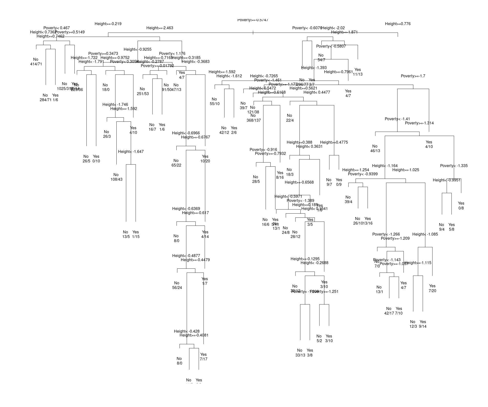

```{r setup, include=FALSE}
knitr::opts_chunk$set(echo = TRUE)
library(dplyr)
library(tidymodels)
```

# Appendix E
## Problem 5

```{r}
helprtc <- 
    mosaicData::HELPrct %>%
    mutate(
        homeless01 = 
            case_when(
                homeless == "housed" ~ 0,
                homeless == "homeless" ~ 1
            )
    ) %>% 
    select(where(is.numeric))
```

Before we start I want to `skimr::skim()` the data to get a general overview of what I'm working with.

```{r}
helprtc %>%
    skimr::skim()
```

There are a few big takeaways from this skimming. 

- First is a large number of NAs. I'm going to outright remove the variables with 200+ missing values as that's nearly half the data set. For the other NAs I'll do median imputation, that is replacing the NA with the median value of that variable. 

- Second are many variables that do not appear to follow a normal distribution. Sadly the `skim()` functions console histograms don't show up on pdf, but trust me here! A few of these numeric variables seem log-linear though, I can log transform those to help the model work better. 

- Finally is the scale of our numeric variables is all over the place. I'll need to normalize all of these variables if I want my model to be able to glean any important information from the data. There is also have an **id** column tucked away in there, I'll need to handle that.

- There's another problem, Looking at some variables there are a few that are identical. I'm not sure what the best way to handle this is outside of manually selecting out the ones I catch. Below are all the variables I caught.

```{r}
helprtc %>%
    select(avg_drinks, i1, max_drinks, i2, hospitalizations, d1) %>%
    head()
```

Here we setup a recipe, this a convenient way to tackle a lot of the data pre-processing I want to do. This makes life a whole lot easier when working with a data set that's a little moody.

```{r}
homeless_recipe <- 
    recipe(homeless01 ~., data = helprtc) %>%
    # Make homeless01 a factor ----
    step_mutate(homeless01 = homeless01 %>% as.factor()) %>%
    
    # Remove duplicate variables and variables w/ over 200+ NAs ----
    step_select(-c(i1, i2, d1, anysubstatus, daysanysub, e2b)) %>%
    
    # Set id column to be an id, not a predictor ----
    update_role(id, new_role = "id") %>%
    
    # Do median imputation for variables with missing values ----
    step_impute_median(dayslink, drugrisk, linkstatus) %>%
    
    # Normalize numeric predictors so they're on the same scale ----
    step_normalize(all_numeric_predictors()) %>%
    
    # Log transform variables that appear log-normal to help it approach a normal dist ----
    step_log(avg_drinks, max_drinks, indtot, age, signed = TRUE)

homeless_recipe
```

Next we'll create our model and pass both it and our recipe into a workflow!

```{r}
homeless_model <-
    logistic_reg(mode = "classification") %>%
    set_engine("glm")

homeless_workflow <-
    workflow() %>%
    add_model(homeless_model) %>%
    add_recipe(homeless_recipe)

homeless_workflow
```

Workflows are fantastic, they help organize the modeling process and encourage good methodology. Essentially you can bind modeling and pre-processing objects together! 

```{r}
fit(homeless_workflow, helprtc) %>%
    broom::tidy() %>%
    arrange(p.value)
```

At the risk of interpreting these results incorrectly, it appears that, according to our p-values, that we only really have 3 predictors that we have significant evidence for. It is important to note, that with our `homeless0` column, 0 is for housed individuals and 1 is for unhoused individuals. Our first predictor, `pss_fr` is a quantifier for an individuals perceived social support by friends with higher scores indicating more support. The negative coefficient indicates that higher support from friends is a predictor of not being homeless. We see this negative coefficient with `female` as well, which indicates that being female may make someone less likely to be homeless. `avg_drinks` is the last of the predictors with a p.value less than or close to 0.05, and it shows a pretty strong relationship between a larger number of drinks consumed per day and homelessness. 

To turn this into a parsimonious model we will only pick the three best variables picked above. Two of them have p-values greater than .05, but they're both incredibly close and the only alternative would be a univariate model. 

```{r}
updated_recipe <-
    recipe(homeless01 ~ pss_fr + avg_drinks + female, data = helprtc) %>%
    
    # Make homeless01 a factor ----
    step_mutate(homeless01 = homeless01 %>% as.factor()) %>%
    
    # Normalize numeric predictors so they're on the same scale ----
    step_normalize(pss_fr, avg_drinks, female) %>%
    
    # Log transform variables that appear log-normal to help it approach a normal dist ----
    step_log(avg_drinks, signed = TRUE)

homeless_workflow <-
    workflow() %>%
    add_model(homeless_model) %>%
    add_recipe(updated_recipe)

fit(homeless_workflow, helprtc) %>%
    broom::tidy() %>%
    arrange(p.value)
```

Here our model is far more frugal. 

\pagebreak
# Chapter 10
## Problem 3


```{r}
# A

helprtc <-
    helprtc %>%
    mutate(homeless01 = homeless01 %>% as.factor)

my_null_log <- glm(homeless01 ~ 1, data = helprtc, family = "binomial")

pred <- 
    helprtc %>%
    select(homeless01) %>%
    bind_cols(
        pred = stats::predict(my_null_log, newdata = helprtc, type = "response")
    ) %>%
    mutate(
        pred = case_when(
            pred > 0.5 ~ 1,
            pred < 0.5 ~ 0
        ),
        pred = factor(pred, levels = c("0", "1"))
    ) 

pred %>%
    conf_mat(truth = homeless01, estimate = pred)
```


```{r}
# B

log_model <- glm(homeless01 ~ age, data = helprtc, family = "binomial")
log_model

```

The negative coefficient on the intercept here indicates that we're starting with a chance of homelessness less than 50% when age = 0. The coefficient next to age shows what is likely an incredibly poor positive relationship between age and homelessness. 

```{r}
# C

stats::predict(log_model, newdata = data.frame(age = c(20,40)), type = "response")
```

This predicts a 37% chance of homelessness at age 40 and a 48% chance at age 40. 

```{r}
# D

pred <- 
    helprtc %>%
    select(homeless01, age) %>%
    bind_cols(
        stats::predict(log_model, newdata = helprtc, type = "response")
    ) %>%
    rename(pred = ...3) %>%
    mutate(
        pred = case_when(
            pred > 0.5 ~ 1,
            pred < 0.5 ~ 0
        ),
        pred = as.factor(pred),
        homeless01 = as.factor(homeless01)
    ) 

pred %>%
    conf_mat(truth = homeless01, estimate = pred)
```

This model incorrectly assigns many people. It makes 161 incorrect "housed" classifications for individuals that are actually homeless.

***
\pagebreak

# Chapter 11
## Problem 4

```{r}
nasaweather::storms %>%
    ggplot(aes(x = pressure, y = wind, color = type)) +
    geom_point(alpha = 0.5)
```

A decision tree would be great for this data because the types are very neatly separated by pressure and wind values. It likely wouldn't be perfect, but no model needs to be. There are 4 fairly distinct regions for each of the 4 types. 

***
\pagebreak
### Exercise 6 (a,c)

```{r}
nhanes <- NHANES::NHANES
```

```{r}
# Write my own scale function to circumvent bugs

my_scale <- function(x) {
    (x - mean(x, na.rm=TRUE)) / sd(x, na.rm=TRUE)
}
```

```{r}
sleep <- 
    nhanes %>%
    select(SleepTrouble, Poverty, Height) %>%
    na.omit() %>%
    mutate(
        Poverty = my_scale(Poverty),
        Height = my_scale(Height)
    )

sleep_split <- 
    sleep %>%
    rsample::initial_split(.8)

sleep_train <-
    sleep_split %>%
    rsample::training()

sleep_test <-
    sleep_split %>%
    rsample::testing()
```

### Decision Tree

```{r}
my_tree <-
    rpart::rpart(
        SleepTrouble ~ Poverty + Height,
        data = sleep_train,
        control = rpart::rpart.control(cp = 0.001)
    )
```

Getting this tree to have more than 1 root node and less than 5 million was a task. I decided to simply let it have too much complexity and chalk it up to a flaw of the model. The overly complex tree can be seen completely zoomed out on the page below.

```{r, eval=FALSE, echo=FALSE}
plot(my_tree, compress = TRUE)
text(my_tree, use.n = TRUE)
```


```{r}
predType <-
    predict(my_tree, type = "class")

types <-
    data.frame(Actual = sleep_train$SleepTrouble, Predicted = predType)

types %>% table()
```

```{r}
accuracy(types, truth = Actual, estimate = Predicted)
```

```{r}
sleep_train %>%
    dplyr::group_by(SleepTrouble) %>%
    dplyr::summarise(
        count = n(),
        percent = n() / nrow(sleep_train) * 100
    )
```

We see a 75/25 split here between no's and yes's. A null model that would assume no 100% of the time would have an accuracy of around 75%, so this decision tree would see a marginal increase against the null model if all one was concerned about was accuracy. Looking at the confusion matrix for our tree we see a lot of mis-classification, but many people with sleep trouble **were** captured, which is great. Overall, this model performs well enough on the training set. 

***
### Random Forest

```{r}
my_forest <- 
    randomForest::randomForest(
        SleepTrouble ~ Height + Poverty,
        data = sleep_train,
        ntree = 500,
        mtry = 2
    )
```

```{r}
my_forest$confusion
```

```{r}
correct_class_rate <- (sum(diag(my_forest$confusion)) / nrow(sleep_train)) %>% round(digits = 3)
```

```{r, echo=FALSE}
glue::glue("The correct classification rate is {correct_class_rate}")
```

```{r}
my_forest$importance
```

We see height being the more important of the two variables. Overall this model performs better than the decision tree.

***
### K-Nearest Neighbors

```{r}

my_knn <- 
    class::knn(
        train = sleep_train %>% select(Poverty, Height),
        test = sleep_test %>% select(Poverty, Height),
        cl = sleep_train$SleepTrouble,
        k = 3
    )

sleep_knn_results <- data.frame(Actual = sleep_test$SleepTrouble, Predicted = my_knn)
```

```{r}
knn_conf_mat <- 
    sleep_knn_results %>%
    table()

knn_conf_mat
```

```{r}
sum(diag(knn_conf_mat)) / nrow(sleep_knn_results)
```

Here we have a correct classification rate of 72%, which unperforms even the null model. 

## All of those but with a 75/25 split instead of an 80/20 one.

```{r}
sleep_split <- 
    sleep %>%
    rsample::initial_split(.75)

sleep_train <-
    sleep_split %>%
    rsample::training()

sleep_test <-
    sleep_split %>%
    rsample::testing()
```

### Decision Tree

```{r}
my_tree <-
    rpart::rpart(
        SleepTrouble ~ Poverty + Height,
        data = sleep_train,
        control = rpart::rpart.control(cp = 0.001)
    )
```


```{r, eval=FALSE, echo=FALSE}
plot(my_tree, compress = TRUE)
text(my_tree, use.n = TRUE)
```

```{r}
predType <-
    predict(my_tree, type = "class")

types <-
    data.frame(Actual = sleep_train$SleepTrouble, Predicted = predType)

types %>% table()
```

```{r}
accuracy(types, truth = Actual, estimate = Predicted)
```

```{r}
sleep_train %>%
    dplyr::group_by(SleepTrouble) %>%
    dplyr::summarise(
        count = n(),
        percent = n() / nrow(sleep_train) * 100
    )
```

***
### Random Forest

```{r}
my_forest <- 
    randomForest::randomForest(
        SleepTrouble ~ Height + Poverty,
        data = sleep_train,
        ntree = 500,
        mtry = 2
    )
```

```{r}
my_forest$confusion
```

```{r}
correct_class_rate <- (sum(diag(my_forest$confusion)) / nrow(sleep_train)) %>% round(digits = 3)
```

```{r, echo=FALSE}
glue::glue("The correct classification rate is {correct_class_rate}")
```

```{r}
my_forest$importance
```


***
### K-Nearest Neighbors

```{r}

my_knn <- 
    class::knn(
        train = sleep_train %>% select(Poverty, Height),
        test = sleep_test %>% select(Poverty, Height),
        cl = sleep_train$SleepTrouble,
        k = 3
    )

sleep_knn_results <- data.frame(Actual = sleep_test$SleepTrouble, Predicted = my_knn)
```

```{r}
knn_conf_mat <- 
    sleep_knn_results %>%
    table()

knn_conf_mat
```

```{r}
sum(diag(knn_conf_mat)) / nrow(sleep_knn_results)
```
