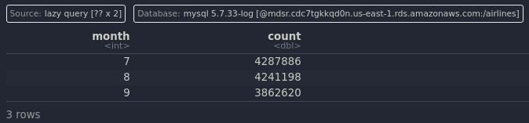

```{r setup, include=FALSE}
knitr::opts_chunk$set(echo = TRUE, out.width = "70%")
library(DBI)
library(RMySQL)
library(dplyr)
```

# NOTE
Any random extra query parameters were added due to either curiosity or a desire to shorten the query time. 

# Exercise 1

```{r}
db_con <-
    DBI::dbConnect(
        drv = MySQL(),
        dbname = "airlines",
        host = "mdsr.cdc7tgkkqd0n.us-east-1.rds.amazonaws.com",
        user = "mdsr_public",
        password = "ImhsmflMDSwR"
    )
```

```{r}
# A

db_con %>% class()
```

The class is a MySQLConnection.

```{r}
# B

DBI::dbListTables(db_con)
```

There are four separate tables in the database.

```{r}
# C

# Described the contents of the airports table:
dbGetQuery(
    conn = db_con,
    statement = "DESCRIBE airports;"
) %>%
    nrow()
```

There are 9 fields in airports.

```{r}
# D

# Described the contents of the flights table:
dbGetQuery(
    conn = db_con,
    statement = "DESCRIBE flights;"
) %>%
    nrow()
```

There are 21 fields in flights.

***
# Exercise 2

```{r}
DBI::dbGetQuery(
    conn = db_con,
    statement = "SELECT carrier, tailnum 
                FROM flights
                LIMIT 0,5;"
)
```

***
\pagebreak
# Exercise 3

```{r}
# A

my_carriers <-
    DBI::dbGetQuery(
    conn = db_con,
    statement = "
        SELECT *
        FROM carriers;
    "
)

my_carriers %>% is.data.frame()
```

Cool thing I learned passively googling is that you can just do SQL queries directly in a separate code chunk if you specify sql as the language and provide it the connection we created earlier. The output is a table that is very easy on the eyes. 

```{sql connection=db_con}
# Using SQL directly

SELECT * FROM carriers
```

```{r}
# B

my_carriers %>%
    object.size() %>%
    print(units = "Kb")
```

`my_carries` is approximately 235 kilobytes large.

\pagebreak
# Exercise 4

```{r}
my_airports <-
    DBI::dbGetQuery(
    conn = db_con,
    statement = "
        SELECT *
        FROM airports;
    "
)
```

```{r}
# A and B

glue::glue("The airports data set has 
           {my_airports %>% nrow()} rows and {my_airports %>% ncol()} columns.")
```

***
\pagebreak
# Exercise 5

```{r}
DBI::dbGetQuery(
    conn = db_con,
    statement = "
        SELECT distance / air_time * 60 AS trvl_speed
        FROM flights
        LIMIT 0,5;
    "
)
```

```{sql connection=db_con}
# Using SQL directly

SELECT distance / air_time * 60 AS trvl_speed
FROM flights
LIMIT 5
```

***
\pagebreak
# Exercise 6

```{r}
# A

DBI::dbGetQuery(
    conn = db_con,
    statement = "
        SELECT *
        FROM flights
        WHERE arr_delay > 120
        LIMIT 0,5;
    "
)
```

```{r}
# B

DBI::dbGetQuery(
    conn = db_con,
    statement = "
        SELECT year, month, day, dest
        FROM flights
        WHERE dest IN ('IAH', 'HOU')
        LIMIT 0,5;
    "
)
```

```{r}
# C

DBI::dbGetQuery(
    conn = db_con,
    statement = "
        SELECT dep_time, dep_delay, arr_delay, carrier
        FROM flights
        WHERE carrier IN ('UA', 'AA', 'DL')
        LIMIT 0,5;
    "
)
```

For fun I'll just use SQL directly on parts d, e and f.

```{sql connection=db_con}
# D

SELECT year, month, day
FROM flights
WHERE month BETWEEN 7 and 9 AND year = 2013
LIMIT 0,5;
```

```{sql connection=db_con}
# E

SELECT dep_time, arr_time
FROM flights
WHERE dep_time = 2400 OR dep_time BETWEEN 0 and 600 AND year = 2013
LIMIT 0,5;
```

```{r, eval=FALSE}
# F

DBI::dbGetQuery(
    conn = db_con,
    statement = "
        SELECT carrier, month, arr_delay
        FROM flights
        WHERE carrier = 'UA' AND month = 7 AND arr_delay > 120 AND year = 2013
        LIMIT 0,5;
    "
)
```

```{r}

```


***
\pagebreak
# Exercise 7

```{r}
# A

DBI::dbGetQuery(
    conn = db_con,
    statement = "
        SELECT carrier, MIN(dep_delay) AS minimum_delay
        FROM flights
        WHERE year = 2013 AND month = 6 AND day = 26
        GROUP BY carrier
        LIMIT 0,5;
    "
)
```

```{r}
# B

DBI::dbGetQuery(
    conn = db_con,
    statement = "
        SELECT carrier, MIN(dep_delay) AS minimum_delay, MAX(dep_delay) AS maximum_delay
        FROM flights
        WHERE year = 2013 AND month = 6 AND day = 26
        GROUP BY carrier
        LIMIT 0,5;
    "
)
```

***
\pagebreak
# Exercise 8

```{r, eval = FALSE}
dbGetQuery(
    conn = db_con,
    statement = "SELECT carrier, dest, AVG(arr_delay) AS meanArrDelay
                FROM flights
                WHERE year = 2013 AND month = 6 AND day = 26 AND origin = 'BDL'
                GROUP BY dest;"
)
```

This selects the carrier and destination columns unchanged. It also creates a new column for the AVERAGE arrival delay for each destination. This selection only occurs on June 26th, 2013 where the origin of the flight was BDL. 

```{r, eval = FALSE}
dbGetQuery(
    conn = db_con,
    statement = "SELECT carrier, dest, AVG(arr_delay) AS meanArrDelay,
                AVG(distance) AS meanDist
                FROM flights
                WHERE year = 2013 AND month = 6 AND day = 26 AND origin = 'BDL'
                GROUP BY dest;"
)
```

This is the same as the previous example, but instead we also calculate the average distance for each destination. 

***
\pagebreak
# Exercise 9

```{r, eval=FALSE}
# A

dbGetQuery(
    conn = db_con,
    statement = "SELECT dest, AVG(air_time) AS avg_travel_time
                FROM flights
                WHERE year = 2013 AND origin = 'BDL'
                GROUP BY dest
                ORDER BY avg_travel_time ASC
                LIMIT 0,5;"
)
```

```{r, echo=FALSE}
knitr::include_graphics("images/prob_9a.png")
```


EWR was the shortest. 

```{r, eval=FALSE}
# B

dbGetQuery(
    conn = db_con,
    statement = "SELECT dest, AVG(air_time) AS avg_travel_time
                FROM flights
                WHERE year = 2013 AND origin = 'BDL'
                GROUP BY dest
                ORDER BY avg_travel_time DESC
                LIMIT 0,5;"
)
```

```{r, echo=FALSE}
knitr::include_graphics("images/prob_9b.png")
```


LAX was the longest average travel time.

***
# Exercise 10

```{r, eval=FALSE}
# A

dbGetQuery(
    conn = db_con,
    statement = "SELECT dest, COUNT(*) AS num_flights
                FROM flights
                WHERE year = 2013 AND origin = 'BDL'
                GROUP BY dest
                ORDER BY num_flights DESC
                LIMIT 0,5;"
)
```

```{r, echo=FALSE}
knitr::include_graphics("images/prob_10a.png")
```


ORD had the most flights.

```{r, eval=FALSE}
# B

dbGetQuery(
    conn = db_con,
    statement = "SELECT tailnum, COUNT(*) AS num_flights
                FROM flights
                WHERE year = 2013 AND origin = 'BDL'
                GROUP BY tailnum
                ORDER BY num_flights DESC
                LIMIT 0,5;"
)
```

```{r, echo=FALSE}

```

Tailnumber `N128UW` had the most flights.

***
\pagebreak
# Exercise 11

```{r, eval=FALSE}
# A

dbGetQuery(
    conn = db_con,
    statement = "SELECT dest, COUNT(*) AS numFlights,
                AVG(arr_delay) AS avg_arr_delay
                FROM flights
                WHERE year = 2013 AND origin = 'BDL'
                GROUP BY dest
                HAVING avg_arr_delay > 0;"
)
```

```{r, echo=FALSE}

```

```{r, eval=FALSE}
# B

dbGetQuery(
    conn = db_con,
    statement = "SELECT dest, COUNT(*) AS numFlights,
                AVG(arr_delay) AS avg_arr_delay
                FROM flights
                WHERE year = 2013 AND origin = 'BDL'
                GROUP BY dest
                HAVING avg_arr_delay > 0 AND numFlights > 1000;"
)
```

```{r, echo=FALSE}

```

***
# Exercise 12

```{r, eval=FALSE}
dbGetQuery(
    conn = db_con,
    statement = "SELECT carrier, AVG(dep_delay) AS avg_dep_delay
                FROM flights
                WHERE year = 2013 AND origin = 'BDL'
                GROUP BY carrier
                HAVING avg_dep_delay > 10;"
)
```

```{r, echo=FALSE}
knitr::include_graphics("images/prob_12.png")
```

***

# Exercise 13
```{r, eval=FALSE}
dbGetQuery(conn = db_con,
           statement = "SELECT dest, COUNT(*) AS numFlights, AVG(arr_delay) AS avg_arr_delay
                        FROM flights
                        WHERE year = 2013 AND origin = 'BDL'
                        GROUP BY dest
                        HAVING numFlights > 365 * 2
                        ORDER BY avg_arr_delay ASC
                        LIMIT 5, 4;"
)
```

```{r, echo=FALSE}

```

***
\pagebreak
# Exercise 14

```{r}
dbGetQuery(conn = db_con,
           statement = "SELECT dest, flight, carrier, airports.name
                        FROM flights
                        JOIN airports ON flights.dest = airports.faa
                        WHERE year = 2013 AND month = 6 AND day = 26 AND origin = 'BDL'
                        LIMIT 10;"
)
```

The destination airport for flight 4714 is Neward Liberty Intl. 

***
\pagebreak
# Exercise 15

```{r}
# A

dbGetQuery(conn = db_con,
           statement = "SELECT dest, flight, carriers.carrier
                        FROM flights
                        JOIN carriers ON flights.carrier = carriers.carrier
                        WHERE year = 2013 AND month = 6 AND day = 26 AND origin = 'BDL' AND dest = 'MSP'
                        LIMIT 10;"
)
```

```{r}
# B

dbGetQuery(conn = db_con,
           statement = "SELECT dest, flight, carriers.carrier, carriers.name
                        FROM flights
                        JOIN carriers ON flights.carrier = carriers.carrier
                        WHERE year = 2013 AND month = 6 AND day = 26 AND origin = 'BDL' AND name = 'Mesa Airlines Inc.'
                        LIMIT 50;"
)
```

***
\pagebreak
# Exercise 16

```{r, eval=FALSE}
dbGetQuery(conn = db_con,
           statement = "SELECT origin, dest, name AS dest_name, flight, carrier
                        FROM flights
                        LEFT JOIN airports ON flights.dest = airports.faa
                        WHERE year = 2013 AND month = 6 AND day = 26 AND origin = 'PBI';")
```

```{r, eval=FALSE}
dbGetQuery(conn = db_con,
           statement = "SELECT origin, dest, name AS dest_name, flight, carrier
                        FROM flights
                        JOIN airports ON flights.dest = airports.faa
                        WHERE year = 2013 AND month = 6 AND day = 26 AND origin = 'PBI';")
```

`LEFT JOIN` returns everything that matches the query for the flights dataset. Rows that don't have information in the airports dataset are kept, just get NAs tacked onto stuff that doesn't apply. `JOIN` doesn't work that way, and will exclude rows that aren't in both. Based on `JOIN` returning one less, it can be assumed that there's one row that isn't in both. 

***

# Exercise 17

```{r, eval=FALSE}
dbGetQuery(conn = db_con,
           statement = "(SELECT year, month, day, origin, dest, flight, carrier
                        FROM flights
                        WHERE year = 2013 AND month = 6 AND day = 26
                        AND origin = 'BDL' AND dest = 'ORD')
                        UNION
                        (SELECT year, month, day, origin, dest, flight, carrier
                        FROM flights
                        WHERE year = 2013 AND month = 6 AND day = 26
                        AND origin = 'MSP' AND dest = 'JFK');"
)

```

This query is a combination of the flights on June 6th, 2016 where **either** (the origin is BDL **and** the destination is ORD) **or** (the origin is MSP **and** the destination is JFK). 

***
\pagebreak
# Exercise 18

```{r, eval=FALSE}
dbGetQuery(conn = db_con,
           statement = "SELECT dest, COUNT(*)
                        FROM flights
                        WHERE year = 2013
                        AND origin = 'BDL'
                        AND dest IN
                            (SELECT faa
                            FROM airports
                            WHERE tz < -7)
                        GROUP BY dest;"
)
```

```{r, echo=FALSE}

```


LAS and LAX were the two destinations traveled to.

***
# Exercise 19

```{r, eval=FALSE}
dbGetQuery(conn = db_con,
           statement = "SELECT dest, COUNT(*)
                        FROM flights
                        WHERE year = 2013
                        AND origin = 'JFK'
                        AND dest IN
                            (SELECT faa
                            FROM airports
                            WHERE tz < -8)
                        GROUP BY dest;"
)
```

```{r, echo=FALSE}

```

HNL was the only airport traveled to.

***
\pagebreak
# Exercise 20

```{r}
flights <- tbl(db_con, "flights")
carriers <- tbl(db_con, "carriers")
```

```{r}
flights %>%
    select(carrier, tailnum) %>%
    head()
```

***
\pagebreak
# Exercise 21

```{r}
# A

flights %>%
    filter(arr_delay > 120) %>%
    head()
```

```{r}
# B

# Note: select() added just to showcase the query working w/ less columns. 
flights %>%
    select(dest, tailnum, carrier) %>%
    filter(dest %in% c('IAH', 'HOU')) %>%
    head()
```

```{r}
# C

# summarise used to showcase the query working and not only returning AA flights.
flights %>%
    select(dest, tailnum, carrier) %>%
    filter(carrier %in% c('UA', 'AA', 'DL')) %>%
    group_by(carrier) %>%
    summarise(count = n())
```

```{r, eval=FALSE}
# D

flights %>%
    select(dest, tailnum, month) %>%
    filter(between(month, 7, 9)) %>%
    group_by(month) %>%
    summarise(count = n())
```

```{r, echo=FALSE}

```

```{r}
# E

flights %>%
    filter(dep_time == 2400 | between(dep_time, 0, 600)) %>%
    head()
```

```{r}
# F

flights %>% 
    filter(carrier == 'UA' & month == 7 & arr_delay > 120) %>%
    head()
```

***
\pagebreak
# Exercise 22

```{r}
db_con <- dbConnect(drv = RSQLite::SQLite(),
                    dbname = ":memory:")
```

```{r}
dbWriteTable(conn = db_con,
             name = "whoTable",
             value = tidyr::who)

#Load the population table:
dbWriteTable(conn = db_con,
             name = "popTable",
             value = tidyr::population)
```

```{r}
# A

dbGetQuery(conn = db_con,
           statement = "SELECT country, year, new_sp_m014
                        FROM whoTable
                        LIMIT 10;")
```

```{r}
dbGetQuery(conn = db_con,
           statement = "SELECT country, year, new_sp_m014
                        FROM whoTable
                        WHERE country = 'United States of America' AND year >= 2010
                        LIMIT 10;")
```

***
\pagebreak
# Exercise 23

```{r}
dbGetQuery(conn = db_con,
           statement = "SELECT country, year, AVG(new_sp_m014) AS avg_m014
                        FROM whoTable
                        WHERE year = 2013
                        GROUP BY country
                        ORDER BY avg_m014 ASC
                        LIMIT 10;")
```

Only got NAs here, not sure how to fix this in SQL. 