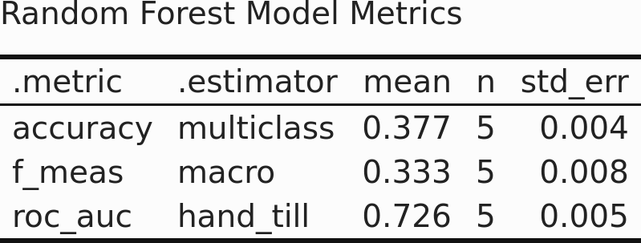

```{r setup, include=FALSE}
knitr::opts_chunk$set(echo = TRUE, out.width="100%", echo = FALSE)
```
	
# Data Work

Not much in general was required for wrangling the data. Much of the same work done in project 1 was done here. I started by reading in the files with `readr::read_csv()` and combining them with `dplyr::bind_rows`. For this project I only wanted to focus on the year 2017 so I used `dplyr::filter(year == 2017)` for that purpose. From there it was all pre-processing based on the models specific needs. I had to consider if the data needed to be scaled and centered (or normalized) and chose not to. All of the numeric variables I was working with were already using a [-100, 100] scale as they represented percents so I decided that wouldn't be necessary. In retrospect dividing them by 100 to get them out of percents may have been the right call but I do not know if it would have changed much. 

As for model specific pre-processing, the two classification models I made required me to convert my response variable to a factor, and when working with **fourcat** I had to omit a large number of NAs. In my logistic model I looked at the **public** variable specifically because it had a completeness of 100%. I do wonder if the large number of levels in **fourcat** hurt the model at all as I did not re-code them manually. I should also note that I used bootstrap re-sampling for both my linear regression model and my random forest model. I opted to not do so for the logistic model as all I needed for that was the coefficients. 

I do feel it necessary to justify my use of packages we have not used in class. For this project I used `tidymodels`, which is the framework I learned for an upcoming data science internship I'll be doing. Tidymodels uses a standardized system to work through modeling which I very much enjoy. You have your **recipe** which handles data pre-processing, **models** like you would expect, and **workflows** that combine the two. From there you can easily update what you need if you need to tune hyper-parameters and finalize your workflow when you want to fit it to the test data. It's a fantastic system and is effective enough to be seen as a competitor to python's `scikit-learn`. I don't quite show off here how great this system is though, as I was not prioritizing model effectiveness with this project.

\pagebreak
# Multiple Linear Regression

For the multiple linear regression I looked at the college representation of the Hispanic population as a function of the representation of the black, white and Asian populations. The coefficients for this model are below.

```{r}

```

The coefficients here indicate a negative relationship between Hispanic representation and the representation of the three other groups. The intercept being at -2.4 shows that even when representation of the three groups is completely accurate, that the Hispanic population is still under-represented. We also have incredibly small p-values here, showing statistical significance of all the given values. Is this actually a good description of the relationship here though? We can answer that by looking at the metrics below.

```{r}

```


Based on the metrics this model generated, no it isn't, at least I don't think so. The value of $r^2$ in particular is worrying, it indicates a high degree of variability in the data. We want values of $r^2$ closer to 1, and ours is far closer to 0. Any predictions we may attempt using our formula would likely not be very reliable due to how much the real values vary. 

This can be further extrapolated from the root mean squared error. This metric can help us see how far the real values differ from the values predicted by our models formula. Our value is around 8, showing that values tend to end up $\pm 8$ from our models line. Overall it can be seen that the linear regression using the variables I chose wound up being quite unhelpful indeed. This shows how just because you may have low p-values for your input variables that you may still have a poor model. 

***
# Logistic Regression

For logistic regression I decided to explore the relationship between representations of black and white populations and public schools. In other words, public school was the dichotomous variable I chose and black and white representation were my chosen explanatory variables. 

```{r}

```

What we see here are two small negative coefficients for the representation of black and white populations. This shows that these representations are either unrelated to if a school is a public school or, if they are related, are a slight negative predictor of that. The negative sign for our intercept indicates that, given nothing else, it is slightly more likely than not that a school is **not** a public school. 

\pagebreak
# Classification Model

This classification model was tasked with predicting what type of 4-year institution a school belongs to. To do this I opted to go with a **random forest** classification model, using `dif_white`, `dif_black` and `dif_hispa` as my explanatory variables. 

```{r}

```

Overall, the model was definitely not fantastic. Our accuracy was terrible, only correctly classifying around a third of the schools. Our f1 score fared even worse, showing a skewed relationship between precision and recall. Surprisingly enough, the area under the roc curve isn't too bad. This seems weird at first, but shows that this model has good performance classifying positives, but has a high false negative rate. I must admit that interpreting these scores with such a large number of potential factors is difficult. This isn't simply a yes or a no, it's more complicated than that. You have 3 levels of public, 3 levels of private, and a separate for-profit level. I can almost guarantee that I did not do enough pre-processing of that variable to allow my model to make any sense of that. Below is a set sample of predictions my model made. 

```{r}

```

